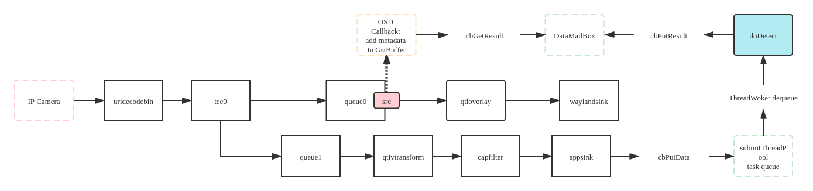

# yolov3-thread-pool
[TOC]

## Overview

本仓库是[Ericsson-Yolov3-SNPE](https://github.com/gesanqiu/Ericsson-Yolov3-SNPE)的优化版本，在使用新框架的基础上新增了一些特性：

- 使用GFlags完成命令行参数的设置；
- 通过读取`json`文件完成程序`Gstreamer pipeline`的配置；
- 抽象标准接口用于控制`Gstreamer pipeline`；
- 引入[draw-rectangle-on-YUV](https://github.com/gesanqiu/draw-rectangle-on-YUV)用于完成在`NV12`图像上画框；
- **使用线程池管理Yolov3算法处理线程。**

### 文件树

```shell
# All source code files have describe at the top of the file.
.
├── CMakeLists.txt
├── configs
│   └── yolov3.json						# pipeline config file
├── inc
│   ├── Common.h
│   ├── DataDoubleCache.h
│   ├── DataInterface.h
│   ├── DataMailbox.h
│   ├── jni_types.h
│   ├── MyUdlLayers.h
│   ├── PipelineInterface.h
│   ├── SafeQueue.h
│   ├── snpe_udl_layers.h
│   ├── ThreadPool.h
│   ├── TimeUtil.h
│   ├── VideoPipeline.h
│   └── YoloClassification.h
├── LICENSE
├── README.md
└── src
    ├── main.cpp
    ├── PipelineInterface.cpp
    ├── VideoPipeline.cpp
    └── YoloClassification.cpp
```

### 开发平台

- 开发平台：Qualcomm® QRB5165 (Linux-Ubuntu 18.04)
- 图形界面：Weston(Wayland)
- 开发框架：Gstreamer，OpenCV-4.2.0
- 算法框架：SNPE
- 算法示例模型：YoloV3
- 第三方库：gflags，json-glib-1.0，glib-2.0
- 构建工具：CMake

## 运行流程



- 解码通过`uridecodebin`完成；
- 使用`tee`插件解耦视频处理和算法处理，维护两个数据缓冲队列完成两者必须的数据交互；
- 给`queue0`插件的`src pad`增加一个probe回调，用于完成图像的画框。

## 线程池

由[Ericsson-Yolov3-SNPE](https://github.com/gesanqiu/Ericsson-Yolov3-SNPE)的测试数据可知，当前算法AIP Runtime的单帧(1920x1080 ppi)处理耗时大约在95ms，并且多实例会导致性能损耗，因此为了达到需求的25FPS实时性能我最少得开辟4个AIP算法实例，而保险起见我初始化了6个并且使用`switch-case`这种十分粗糙的手段完成了多线程的数据同步。

最近闲暇时间学习了线程池的实现，有关线程池的教程可以参考[Thread Pool in C++11](https://ricardolu.gitbook.io/trantor/c++-thread-pool)，在模板中我们从外部传递一个工作函数和相关参数给到线程池，随后唤起空闲线程去执行提交的工作函数。其核心就是一个循环论询的任务队列和多个用于完成任务的工作线程，那么借鉴任务队列的设计思想，**我将算法实例捆绑到工作线程中（固定任务类型，只提交任务所需的参数）**，将pipeline中`appsink`插件吐出来的图像作为任务submit到线程池以此唤醒唤醒空闲（当前未执行/已完成识别任务）的算法实例进行识别，让线程池自动按顺序去完成识别任务，对比旧版在一定程度上降低了空间开销。

- 使用线程池，相当于异步处理图像，由于每个线程中算法实例耗费的识别时间不同，因此存储识别结果的`DataMailBox`中存储的结果向量并不严格符合图像显示顺序，但是差距大致在20ms以内，用户感知并不明显，算是一种妥协。

## 编译&运行

```shell
cmake -H. -Bbuild
cd build && make

# --cfg：pipeline 所用配置文件，用于完成VideoPipelineConfigure结构体的初始化
# --count:yolov3算法实例个数
./AiObject-Yolov3 --cfg ../configs/yolov3.json --count 4
```

## FAQ

- 由于使用新框架直接在NV12图像上画框，因此无法将识别出的物体类别绘制在图像上，有需求可以使用OpenGL绘制。